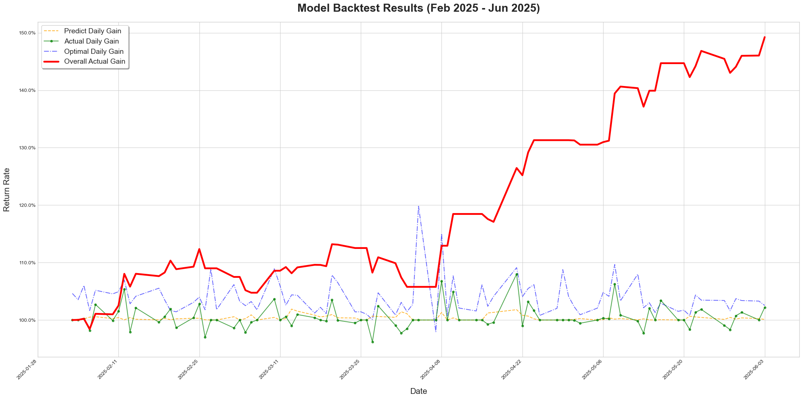

# ML4Investment: Machine Learning for US Stock Investment

This project is designed as a foundational framework, inviting the community to develop custom algorithms for stock price movement prediction. Its modular design also allows for adaptation to other machine learning applications, such as website click-through rate prediction or advertisement targeting.



The current release features:

- A robust framework for training machine learning models to predict U.S. stock price changes.

Problem Statement:

- Many popular U.S. stock prediction projects rely on Large Language Models (LLMs), which can incur significant API costs. This project offers a more cost-effective alternative.
- Engaging in frequent intra-day trading often leads to being categorized as a pattern day trader, which typically requires a substantial account balance and can be mentally taxing. This project focuses on predicting next-day price changes, aiming to reduce the need for constant market monitoring and provide a more sustainable approach to investment.

## Contents
- [ML4Investment: Machine Learning for US Stock Investment](#ml4investment-machine-learning-for-us-stock-investment)
    - [Disclaimer](#Disclaimer)
    - [Contents](#Contents)
    - [Install](#Install)
    - [Usage](#Usage)
    - [Experiments](#Experiments)
    - [Contribute](#Contribute)
    - [Reference](#Reference)

## Disclaimer

This project is provided for **research and demonstration purposes only** and does not constitute investment advice. Any financial decisions made based on this model are entirely at your own risk.

## Install
1. Clone the repository and navigate to the ML4Investment working directory
```bash 
git clone https://github.com/Beryex/ML4Investment.git --depth 1
cd ML4Investment
```
2. Set up environment
```bash 
conda create -n ml4i python=3.11 -y
conda activate ml4i
pip install uv
uv pip install -e '.[dev]'
```
3. Create local configuration by
```bash
cp ml4investment/.env.example ml4investment/.env
```
4. Open the newly created `.env` file and enter your credentials, such as your trading platform's API Key and Secret. The API needs to be applied through Schwab Developer Portal.

## Usage

### Data Preparation

All the data and the optimized results are stored at folder [ml4investment/data](ml4investment/data).

The project supports data collection by loading local files and fetching the latest data via the Schwab API, via
```bash
python fetch_data.py
```

You could also load local files via
```bash
python fetch_data.py -lld -ldp PATH_TO_STOCK_DATA_FOLDER
```

I recommend loading the provided local files for extending your training data to several years back and using the Schwab API to fetch the most recent stock data. 

After downloading the data, navigate to the `ml4investment` directory, which contains the main codebase. 

### Model Training

To train your own model, run
```bash
python train.py # Train the model with default hyperparameters
```
> You can also run ```python train.py -odsp``` to optimize the data sampling proportion, ```python train.py -of``` to optimize features and ```python train.py -omhp``` to optimize model hyperparameters.

### Backtest

To evaluate the model's performance via backtesting, run
```bash
python backtest.py -v
```

This will show the detailed statics result, e.g. MAE, sign accuracy and the actual gain, in the test dataset, as well as the stock-level and daily-level performance.

### Daily Usage 

For daily usage, directly execute
```bash
bash scripts/daily_usage.sh
```

This will fetch the latest U.S. stock data, run the backtest of current model, generate predictions for the price change ratio from the next trading day's open price to the subsequent day's open price and automatically place the orders.

### Develop Your Own Algorithm

The preceding sections covered the daily usage of this project. Here, I'll guide you on how to enhance the pipeline and develop your own customized models.

To get you familiar with the pipeline, here I introduce the main setting and their corresponding file location:
| Description                         | File Path                                                                                       |
| :---------------------------------- | :--------------------------------------------------------------------------                     |
| Pipeline Hyperparameter Settings    | [ml4investment/config/global_settings.py](ml4investment/config/global_settings.py)              |
| LightGBM Model Hyperparameters      | [ml4investment/data/prod_model_hyperparams.json](ml4investment/data/prod_model_hyperparams.json)|
| Feature Selection Result            | [ml4investment/data/prod_features.json](ml4investment/data/prod_features.json)      |
| Stocks for Training                 | [ml4investment/config/train_stocks.json](ml4investment/config/train_stocks.json)                |
| Target Stocks                       | [ml4investment/config/target_stocks.json](ml4investment/config/target_stocks.json)              |
| Stocks for Prediction               | [ml4investment/config/predict_stocks.json](ml4investment/config/predict_stocks.json)            |
> The stocks used for prediction is optimized from target stocks.

To enhance model performance, consider refining the feature engineering process within [`ml4investment/utils/feature_calculating.py`](ml4investment/utils/feature_calculating.py) and [`ml4investment/utils/feature_processing.py`](ml4investment/utils/feature_processing.py) as well as optimizing the model training process in [`ml4investment/utils/model_training.py`](ml4investment/utils/model_training.py). 

To do hyperparameter search, you could directly set the hyperparameters to search and corresponding value list in [`ml4investment/scripts/hyperparameter_search.sh`](ml4investment/scripts/hyperparameter_search.sh). Then run
```bash
bash scripts/hyperparameter_search.sh
```

## Contribute

If you find issues or discover tricks that could improve the algorithm, feel free to directly modify the code and submit a Pull Request.

## Reference
```
@software{ml4investment,
  author       = {Boyao Wang},
  title        = {ML4Investment: Machine Learning for Investment},
  url          = {https://github.com/Beryex/ML4Investment},
  year         = {2025},
  note         = {GitHub repository}
}
```
