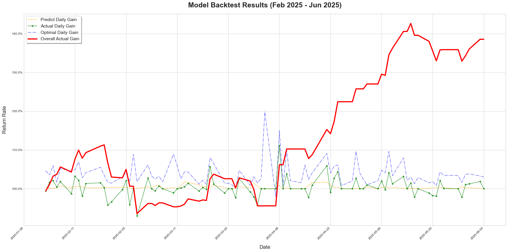

# ML4Investment: Machine Learning for US Stock Investment

This project is designed as a foundational framework, inviting the community to develop custom algorithms for stock price movement prediction. Its modular design also allows for adaptation to other machine learning applications, such as website click-through rate prediction or advertisement targeting.



The current release features:

- A robust framework for training machine learning models to predict U.S. stock price changes.
- A pre-trained model, developed using LightGBM, trained on 226 stocks and 8 ETFs with historical data from January 1, 2016, to January 1, 2025.

Problem Statement:

- Many popular U.S. stock prediction projects rely on Large Language Models (LLMs), which can incur significant API costs. This project offers a more cost-effective alternative.
- Engaging in frequent intra-day trading often leads to being categorized as a pattern day trader, which typically requires a substantial account balance and can be mentally taxing. This project focuses on predicting next-day price changes, aiming to reduce the need for constant market monitoring and provide a more sustainable approach to investment.

## Contents
- [ML4Investment: Machine Learning for US Stock Investment](#ml4investment-machine-learning-for-us-stock-investment)
    - [Disclaimer](#Disclaimer)
    - [Contents](#Contents)
    - [Install](#Install)
    - [Usage](#Usage)
    - [Experiments](#Experiments)
    - [Contribute](#Contribute)
    - [Reference](#Reference)

## Disclaimer

This project is provided for **research and demonstration purposes only** and does not constitute investment advice. Any financial decisions made based on this model are entirely at your own risk.

## Install
1. Clone the repository and navigate to the ML4Investment working directory
```bash 
git clone https://github.com/Beryex/ML4Investment.git --depth 1
cd ML4Investment
git checkout c45bacce5fbe8f12873077594acd790d8df7f548 # For reproduce of this README.md result
```
2. Set up environment
```bash 
conda create -n ml4i python=3.11 -y
conda activate ml4i
pip install uv
uv pip install -e '.[dev]'
```
3. Create local configuration by
```bash
cp ml4investment/.env.example ml4investment/.env
```
4. Open the newly created `.env` file and enter your credentials, such as your trading platform's API Key and Secret. The API needs to be applied through Schwab Developer Portal.

## Usage

### Data Preparation

I provide pre-fetched U.S. stock data and a trained model for convenience. You can download them by executing:
```bash
gdown 1JRnC2BHHy_N6hbPSMaUwuoF5QDN0ZlqC --output ml4investment/data/fetched_data.pkl
gdown 1MYK32WlT6oDuuZyaHVYYqv9LHoNW2k7D --output ml4investment/data/prod_model.model
gdown 1DWwVfCwm_JhE-_1doyrvTq72ho_DwOac --output ml4investment/data/prod_process_feature_config.pkl
```

> This is a one-time operation. You only need to execute this command once when you begin using the project.

This will download fetched_data.pkl, prod_model.model, prod_process_feature_config.pkl and place them at folder [ml4investment/data](ml4investment/data).

The project supports data collection by loading local files and fetching the latest data via the Schwab API. I recommend loading the provided local files for extending your training data to several years back and using the Schwab API to fetch the most recent stock data. 

After downloading the data, navigate to the `ml4investment` directory, which contains the main codebase. 

### Daily Usage

Before you move on, make sure you have the model as well as the data downloaded. 

I recommend executing the following commands before each day's market open to fetch the latest data and predict stock price changes. Based on these predictions, you could then set orders to sell yesterday's holdings at market open and buy new stocks based on the predicted highest price improvement until tomorrow's market open, proportional to your total asset fraction. This strategy aims to ensure timely execution as the market opens.

```bash
python fetch_data.py ; python predict.py -v
```

These commands will fetch the latest U.S. stock data and generate predictions for the price change ratio from the next trading day's open price to the subsequent day's open price.

### Backtest

To reproduce the backtest result, run
```bash
python backtest.py -v
```

This will show the MAE, sign accuracy and the actual gain in the test dataset, which are the latest 84 trading day by default.

### Develop Your Own Algorithm

The preceding sections covered the daily usage of this project. Here, I'll guide you on how to enhance the pipeline and develop your own customized models.

To get you familiar with the pipeline, here I introduce the main setting and their corresponding file location:
| Description                         | File Path                                                                                       |
| :---------------------------------- | :--------------------------------------------------------------------------                     |
| Pipeline Hyperparameter Settings    | [ml4investment/config/global_settings.py](ml4investment/config/global_settings.py)              |
| LightGBM Model Hyperparameters      | [ml4investment/data/prod_model_hyperparams.json](ml4investment/data/prod_model_hyperparams.json)|
| Feature Selection Result            | [ml4investment/data/prod_model_features.json](ml4investment/data/prod_model_features.json)      |
| Stocks for Training                 | [ml4investment/config/train_stocks.json](ml4investment/config/train_stocks.json)                |
| Target Stocks                       | [ml4investment/config/target_stocks.json](ml4investment/config/target_stocks.json)              |
| Stocks for Prediction               | [ml4investment/config/predict_stocks.json](ml4investment/config/predict_stocks.json)              |
> The stocks used for prediction is optimized from target stocks, detailed result could be found at [Experiments](#Experiments).

To enhance model performance, consider refining the feature engineering process within [`ml4investment/utils/feature_engineering.py`](ml4investment/utils/feature_engineering.py) and optimizing the model training process in [`ml4investment/utils/model_training.py`](ml4investment/utils/model_training.py). 

To train your own model, run
```bash
python train.py
```
> You can also run ```python train.py -omf``` to optimize model features and ```python train.py -omhp``` to optimize model hyperparameters.

Additionally, exploring different prediction strategies (e.g., buying the top 3 predicted stocks instead of just the top 1) within [`ml4investment/predict.py`](ml4investment/predict.py) might further enhance actual gains.

## Experiments

I conducted an ablation study on various strategies, with all experiments performed on a consistent test dataset from January 21, 2025, to May 20, 2025 (a total of 84 trading days).

### Start Data Date

Different start Date of the training data is experimented, while the end data date is aligned to be 1.1.2025.

| Start Data Date | Valid Sign Acc | Backtest Sign Acc | Backtest Actual Gain |
| :-------------- | :------------------------------------------------ | :---------------- | :------------------- |
| 1.1.2024        | 64.90                                            | 51.94             | 110.31               |
| 1.1.2023        | 66.58                                            | 51.94             | 98.21                |
| 1.1.2020        | 70.55                                            | 50.75             | 108.37               |
| 1.1.2016        | 69.07                                            | 52.03             | 138.55               |
| 1.1.2015        | 69.21                                            | 51.41             | 102.91               |
> Note: The validation sign accuracy presented here may be less indicative for direct comparison, as the composition of the validation dataset changes with each alteration in the start data date.

### Predict Stock Choices

While an attempt was made to optimize prediction stock choices by selecting target stocks that performed better in the validation dataset, this approach proved less effective than using manually selected target stocks.

| Predict Stocks                         | Backtest Sign Acc | Backtest Actual Gain |
| :------------------------------------- | :---------------- | :------------------- |
| Equal to manually selected target stocks | 52.03             | 138.55               |
| Select 50% with lowest MAE from target stock | 51.90             | 128.63               |
| Select 50% with highest Sign accuracy from target stock | 52.56             | 132.77               |

## Contribute

If you find issues or discover tricks that could improve the algorithm, feel free to directly modify the code and submit a Pull Request.

## Reference
```
@software{ml4investment,
  author       = {Boyao Wang},
  title        = {ML4Investment: Machine Learning for Investment},
  url          = {https://github.com/Beryex/ML4Investment},
  year         = {2025},
  note         = {GitHub repository}
}
```
